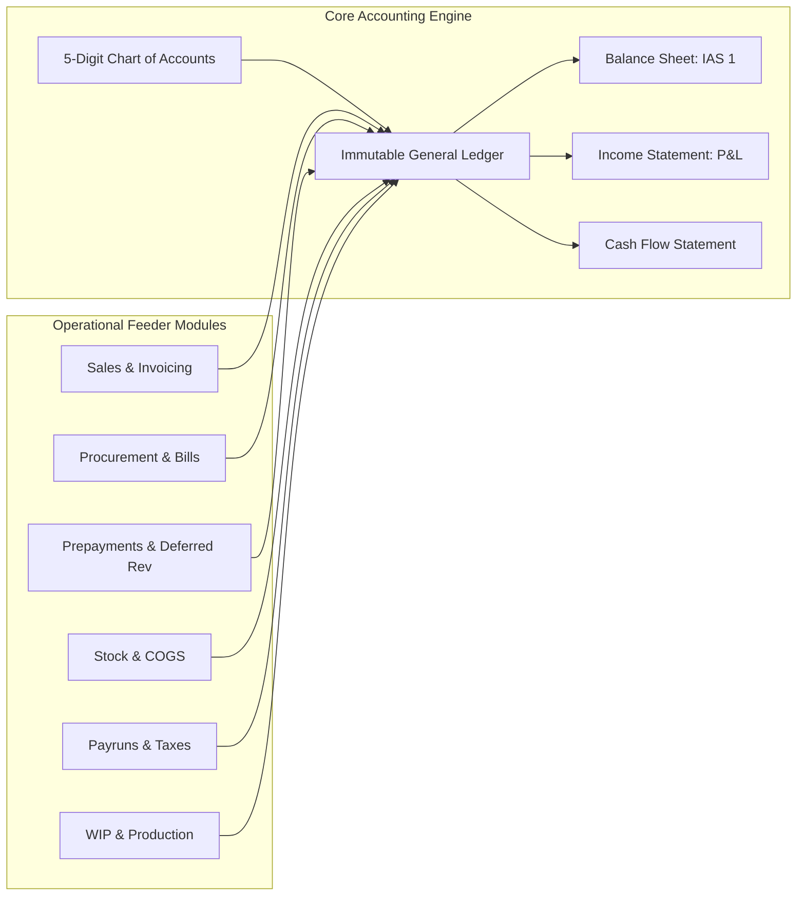
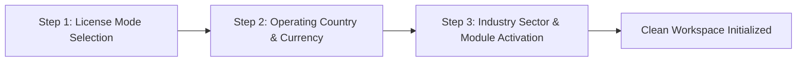
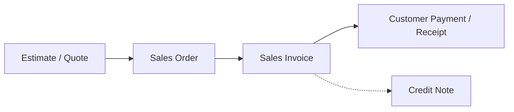
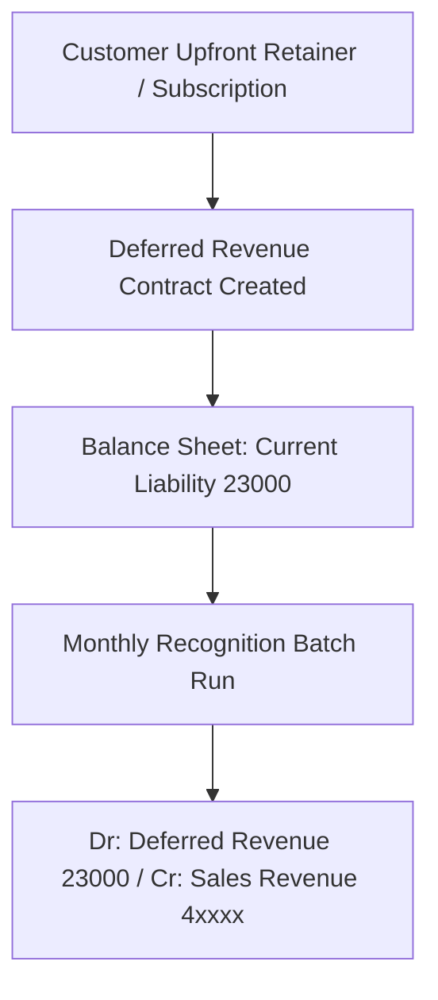
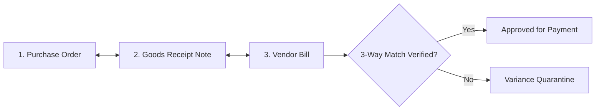
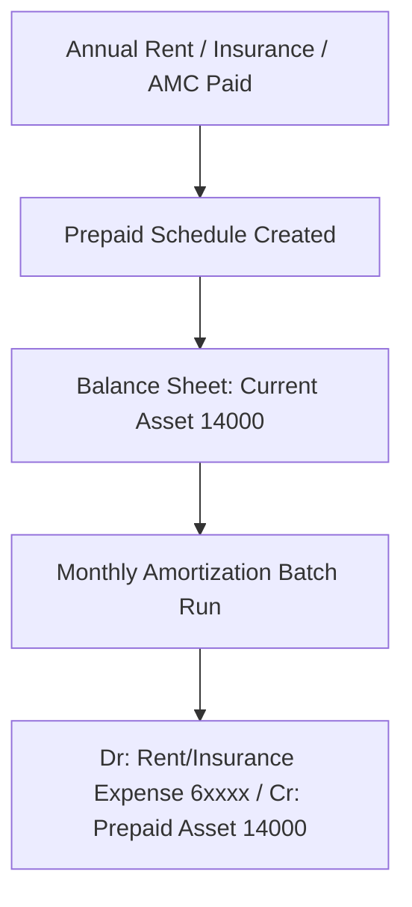
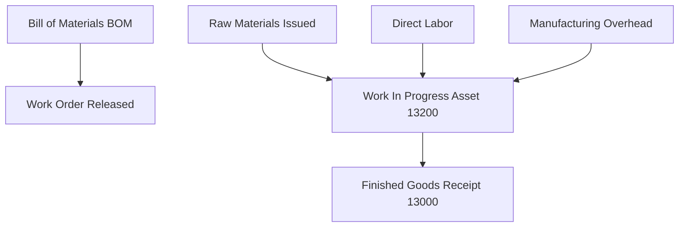

# AccountBook Enterprise ERP — User Manual & Operating Guide

> **Standard Compliance:** Strictly adheres to **IAS (International Accounting Standards)**, **IFRS (International Financial Reporting Standards)**, and **US GAAP (Generally Accepted Accounting Principles)**.

---

## 📑 Table of Contents
1. [System Introduction & Core Accounting Foundations](#1-system-introduction--core-accounting-foundations)
2. [Getting Started: 3-Step Onboarding & Business Setup](#2-getting-started-3-step-onboarding--business-setup)
3. [User Roles, Permissions & Persona Workspaces](#3-user-roles-permissions--persona-workspaces)
4. [Commercial Licensing & In-App Customer Feedback](#4-commercial-licensing--in-app-customer-feedback)
5. [Module 1: Core Accounting & General Ledger](#5-module-1-core-accounting--general-ledger)
6. [Module 2: Sales & Accounts Receivable (AR)](#6-module-2-sales--accounts-receivable-ar)
7. [Module 3: Customer Advances & Deferred Revenue (IFRS 15)](#7-module-3-customer-advances--deferred-revenue-ifrs-15)
8. [Module 4: Procurement & Accounts Payable (AP)](#8-module-4-procurement--accounts-payable-ap)
9. [Module 5: Vendor Prepayments & Amortization Schedules (IAS 1)](#9-module-5-vendor-prepayments--amortization-schedules-ias-1)
10. [Module 6: Banking, Treasury & Cash Flow Management](#10-module-6-banking-treasury--cash-flow-management)
11. [Module 7: Inventory & Warehouse Management](#11-module-7-inventory--warehouse-management)
12. [Module 8: Manufacturing & Production (BOM & Job Costing)](#12-module-8-manufacturing--production-bom--job-costing)
13. [Module 9: Payroll & Human Resources Administration](#13-module-9-payroll--human-resources-administration)
14. [Module 10: Project Accounting & Job Costing](#14-module-10-project-accounting--job-costing)
15. [Module 11: Survey & Field Operations](#15-module-11-survey--field-operations)
16. [Module 12: Global Tax Compliance & E-Invoicing](#16-module-12-global-tax-compliance--e-invoicing)
17. [Module 13: AI Assistant & Advisory Copilot](#17-module-13-ai-assistant--advisory-copilot)
18. [Standard Operating Procedures (SOPs) & Closing Checklists](#18-standard-operating-procedures-sops--closing-checklists)
19. [Troubleshooting & Frequently Asked Questions (FAQ)](#19-troubleshooting--frequently-asked-questions-faq)

---

## 1. System Introduction & Core Accounting Foundations

AccountBook is a multi-sector, multi-entity Enterprise Resource Planning (ERP) platform built with financial integrity at its core.

### 1.1 Strict Double-Entry Bookkeeping
Every transaction in the system must satisfy the fundamental accounting equation:
$$\text{Assets} = \text{Liabilities} + \text{Equity}$$
For every journal entry, voucher, or operational invoice, total Debits must equal total Credits ($\sum \text{Debit} = \sum \text{Credit}$). Out-of-balance entries cannot be posted.

### 1.2 Accrual Basis Accounting (IAS 1 / GAAP)
Revenues and expenses are recorded in the period in which they are earned or incurred, regardless of when cash is received or paid.

### 1.3 Immutable Audit Trails
In compliance with international audit standards, posted transactions are **never hard-deleted**. Any correction requires an offsetting reversing entry or credit/debit note with user and timestamp tracing.

### 1.4 Multi-Currency & Real-Time FX Revaluation (IAS 21)
Transactions can be conducted in foreign currencies (USD, GBP, EUR, AED, SAR, PKR). The system records both transaction currency and functional base currency amounts, computing Realized and Unrealized FX Gains/Losses automatically upon settlement.

---

## 2. Getting Started: 3-Step Onboarding & Business Setup

When a new entity or user logs in for the first time, the system initiates the **3-Step Setup Wizard**:

### Step 1: License Mode Selection
Choose one of the 3 activation options:
* **90-Day Free Commercial Trial:** Instant full enterprise access with countdown tracker.
* **Founding Customer Beta Partner:** Extended access for early adopters.
* **Commercial License Key:** Paste your cryptographically signed license token.

### Step 2: Country Localization & Currency
Select your primary operating jurisdiction. The system configures:
* **Pakistan (PKR):** FBR 16-18% Sales Tax, Provincial PRA/SRB rules, WHT slabs.
* **United States (USD):** State Sales Tax, IRS 1099 compliance.
* **United Kingdom (GBP):** HMRC Making Tax Digital (MTD) 20% standard VAT.
* **United Arab Emirates (AED):** FTA 5% VAT and Corporate Tax compliance.
* **Saudi Arabia (SAR):** ZATCA 15% VAT and Phase 2 E-Invoicing QR codes.
* **Canada (CAD):** CRA GST/HST/PST dual-tax tracking.
* **Germany / EU (EUR):** Standard 19% EU VAT and Reverse Charge Mechanism (RCM).

### Step 3: Industry Sector & Module Auto-Tuning
Select your business sector from the global directory:
* **Commerce & Retail:** Auto-enables Inventory, POS, Multi-Warehouse, Sales.
* **Services & Consulting:** Auto-enables Timesheets, Deferred Revenue Retainers, Milestones.
* **Manufacturing & Industrial:** Auto-enables Bill of Materials (BOM), Work Orders, Job Costing.
* **Construction & Contracting:** Auto-enables Progress Billing, Field Surveys, Inspections.
* **Holding Conglomerate:** Auto-enables Intercompany Allocations, Multi-Entity Consolidation.

---

## 3. User Roles, Permissions & Persona Workspaces

The ERP enforces Role-Based Access Control (RBAC) across 5 pre-configured roles:

| Persona | Role | Primary Modules & Responsibilities |
| :--- | :--- | :--- |
| 👑 **Muhammad Ali** (`admin@acme.com`) | **Super Administrator** | Full system control, entity configuration, user creation, license management, database maintenance. |
| 💼 **Sarah Jenkins** (`accountant@acme.com`) | **Senior Accountant** | Chart of Accounts, Journal Entries, Bank Reconciliation, Prepayments, Financial Reports, Period Closes. |
| 📦 **David Chen** (`inventory@acme.com`) | **Warehouse Manager** | Goods Receipt Notes (GRN), Multi-Warehouse Stock Transfers, Inventory Valuation, Stock Adjustments. |
| 🏭 **Alex Rivera** (`manufacturing@acme.com`) | **Production Engineer** | Bill of Materials (BOM), Work Orders, Overhead & Direct Labor Allocation, Production Runs. |
| 📑 **Amina Al-Mansoor** (`auditor@acme.com`) | **External Auditor** | Read-Only audit trail access, compliance filings, journal inspections, historical transaction logs. |

---

## 4. Commercial Licensing & In-App Customer Feedback

### 4.1 License Tracker & Key Generation
* **Live Expiry Counter:** Displays remaining trial days on the top banner.
* **Admin Key Generator:** Super Admins can generate cryptographically signed client keys for **3-Month, 6-Month, 1-Year, or Lifetime** durations.

### 4.2 Built-In Client Feedback Hub
* **Submitting Feedback:** Click the `💡 Feedback` button in the bottom-right floating trigger bar from any screen.
* **Categories:** Bug Report, Feature Request, Usability Rating (1-5 Stars).
* **Feedback Inbox:** Admins review all client submissions under `Administration → Feedback Inbox`.

---

## 5. Module 1: Core Accounting & General Ledger

### 5.1 Standard 5-Digit Chart of Accounts (COA)
The Chart of Accounts is structured into five core groups:
* **`10000–19999` Assets:** Cash (`11100`), Banks (`11200`), Accounts Receivable (`12000`), Inventory (`13000`), Prepaid Expenses (`14000`), Advances to Suppliers (`14050`), Fixed Assets (`15100`).
* **`20000–29999` Liabilities:** Accounts Payable (`21100`), GRNI Accrual (`21200`), Salaries Payable (`21300`), Sales Tax/VAT Payable (`22000`), WHT Payable (`22100`), Deferred Revenue (`23000`), Customer Advances (`23100`).
* **`30000–39999` Equity:** Share Capital (`31000`), Retained Earnings (`32000`).
* **`40000–49999` Revenue:** Sales Revenue (`40000`), Service & Consulting Revenue (`41000`), Discounts Allowed (`49000`).
* **`50000–59999` Cost of Goods Sold (COGS):** Direct Material (`51000`), Direct Labor (`52000`), Manufacturing Overhead (`53000`).
* **`60000–69999` Operating Expenses:** Office Rent (`61000`), Insurance (`62000`), Utilities (`63000`), Depreciation Expense (`64000`), Salaries & Wages (`65000`).

### 5.2 Creating Manual Journal Entries
1. Navigate to **`Accounting → Journal Entries`**.
2. Click **＋ New Journal Entry**.
3. Select Date, Voucher Reference, and Currency.
4. Add line items specifying Account, Debit, Credit, and Memo.
5. Click **Post Entry**. The system verifies balance ($\text{Debits} = \text{Credits}$) and immutably posts to the GL.

### 5.3 Fixed Asset Register & Automated Depreciation Runs (IAS 16)
1. Register fixed assets under **`Accounting → Fixed Assets`** with Cost, Salvage Value, Useful Life, and Method (Straight-Line or Declining Balance).
2. Run monthly batch depreciation at **`Assets & Inventory → Depreciation Run`**.
3. Click **Execute Depreciation Run** $\rightarrow$ Automatically posts:
   $$\text{Debit: Depreciation Expense (64000)} \quad / \quad \text{Credit: Accumulated Depreciation (15200)}$$

### 5.4 Period Closing & Lock Dates
To protect audited financial statements from backdated modifications:
1. Navigate to **`Accounting → Period Closing`**.
2. Select the closing period (e.g., Monthly or Fiscal Year-End) and set the **Lock Date**.
3. All transactions dated on or before the Lock Date become strictly immutable.

---

## 6. Module 2: Sales & Accounts Receivable (AR)

### 6.1 Creating Sales Invoices
1. Navigate to **`Sales & Customers → Sales Invoices`**.
2. Click **＋ New Invoice**.
3. Select Customer, Payment Terms (Net 30, Due on Receipt), and Currency.
4. Add line items, quantities, unit prices, and applicable Tax Codes (e.g. VAT 20%, Sales Tax 16%).
5. Click **Approve & Post Invoice**.
   * **Automatic GL Posting:**
     $$\text{Dr: Accounts Receivable (12000)} \quad / \quad \text{Cr: Sales Revenue (40000)} \quad / \quad \text{Cr: Output Tax Payable (22000)}$$
   * If physical stock is sold, COGS and Inventory Asset are automatically relieved.

### 6.2 Customer Payments & Receipts
1. Navigate to **`Sales & Customers → Customer Payments`**.
2. Select Customer and Bank/Cash Account.
3. Allocate payment against outstanding invoices.
4. Post receipt $\rightarrow$ Debits Bank (`11200`) and Credits Accounts Receivable (`12000`).

---

## 7. Module 3: Customer Advances & Deferred Revenue (IFRS 15)

Located at **`Sales & Customers → Deferred Revenue & Advances`**.

### 7.1 Recording a Deferred Revenue Contract
1. Click **＋ New Deferred Revenue Contract**.
2. Enter Contract Title, Customer Name, Contract Ref #, Total Amount, Start Date, and End Date (e.g., 12 months).
3. Select **Deferred Revenue Liability Account (`23000`)** and **Revenue Account (`41000`)**.
4. The system calculates the Straight-Line monthly earned revenue schedule.

### 7.2 Running Monthly Revenue Recognition
1. Click **Recognize Revenue (Batch Run)**.
2. Select the cutoff date.
3. The system scans all active customer contracts and generates balanced journal entries:
   $$\text{Debit: Deferred Revenue (23000)} \quad / \quad \text{Credit: Sales / Service Revenue (4xxxx)}$$

---

## 8. Module 4: Procurement & Accounts Payable (AP)

### 8.1 The 3-Way Matching Workflow
To prevent fraudulent or erroneous supplier payouts, the ERP enforces 3-Way Matching:

1. **Purchase Order (PO):** Authorizes agreed quantities and prices.
2. **Goods Receipt Note (GRN):** Confirms physical warehouse delivery, posting temporary `GRNI Accrual (21200)`.
3. **Vendor Bill:** Matches supplier invoice against PO prices and GRN quantities.
   * **Approved Bill Posting:**
     $$\text{Dr: GRNI Accrual (21200)} \quad / \quad \text{Dr: Input VAT (14100)} \quad / \quad \text{Cr: Accounts Payable (21100)}$$

---

## 9. Module 5: Vendor Prepayments & Amortization Schedules (IAS 1)

Located at **`Procurement → Prepayments & Amortization`** and **`Accounting → Prepayment Schedules`**.

### 9.1 Creating a Prepaid Expense Schedule
1. Click **＋ New Prepayment Schedule**.
2. Enter Policy/Contract Title (e.g. *Annual Headquarters Office Rent*).
3. Enter Vendor, Policy Ref #, Total Amount, Currency, Start Date, and End Date (e.g., 12 months).
4. Select **Prepaid Asset Account (`14000`)** and **P&L Expense Account (`61000 Rent Expense`)**.
5. Click **Generate Schedule**.

### 9.2 Running Monthly Expense Amortization
1. Click **Run Monthly Amortization**.
2. Select the cutoff date.
3. Click **Execute Amortization Run** $\rightarrow$ Automatically posts:
   $$\text{Debit: Rent / Insurance / OpEx (6xxxx)} \quad / \quad \text{Credit: Prepaid Expenses (14000)}$$

---

## 10. Module 6: Banking, Treasury & Cash Flow Management

### 10.1 The 5 Standard Voucher Types
* **BPV (Bank Payment Voucher):** Disbursements from bank accounts.
* **BRV (Bank Receipt Voucher):** Inward funds received into bank accounts.
* **CPV (Cash Payment Voucher):** Petty cash disbursements.
* **CRV (Cash Receipt Voucher):** Petty cash collections.
* **JV (Journal Voucher):** Non-cash GL adjustments, accruals, and amortizations.

### 10.2 Bank Statement Import & Reconciliation
1. Navigate to **`Banking & Payments → Bank Reconciliation`**.
2. Import bank statement CSV/OFX files under **`Bank Import`**.
3. The reconciliation engine auto-matches bank statement lines against GL ledger transactions by Date, Reference, and Amount.
4. Mark matched items to resolve outstanding uncleared deposits and unpresented checks.

---

## 11. Module 7: Inventory & Warehouse Management

* **Stock Valuation Methods:** Real-time FIFO (First-In, First-Out) and Weighted Average Costing (WAC).
* **Multi-Warehouse Transfers (STN):** Transfer inventory between central warehouses, branch stores, or production sites with in-transit tracking.
* **Physical Stock Counts & Shrinkage:** Adjust inventory balances with automated write-off posting:
  $$\text{Debit: Inventory Shrinkage / Damage Expense (6xxxx)} \quad / \quad \text{Credit: Inventory Asset (13000)}$$

---

## 12. Module 8: Manufacturing & Production (BOM & Job Costing)

1. **Bill of Materials (BOM):** Define raw material quantities, scrap percentages, and standard labor hours required per finished unit.
2. **Work Order Execution:** Issue raw materials from stock to `Work-in-Progress (WIP)`.
3. **Completed Production:** Receive finished products into inventory, transferring accumulated WIP cost into `Finished Goods (13000)`.

---

## 13. Module 9: Payroll & Human Resources Administration

1. **Employee Profiles:** Manage salary structures, allowances (House Rent, Conveyance, Medical), and deductions.
2. **Tax Slabs & Social Security:** Configured with country-specific income tax withholding, pension funds (PF), and social security (EOBI).
3. **Monthly Payrun Execution:**
   * Step 1: Review attendance and leave deductions.
   * Step 2: Calculate net salaries and tax withholding.
   * Step 3: Post Payrun to GL:
     $$\text{Dr: Salaries Expense (65000)} \quad / \quad \text{Cr: Payroll Tax Payable (21400)} \quad / \quad \text{Cr: Net Salaries Payable (21300)}$$
   * Step 4: Disburse bank salary transfers and generate individual PDF Salary Slips.

---

## 14. Module 10: Project Accounting & Job Costing

* **Project Budgets & Milestones:** Track estimated vs. actual project costs (Material, Labor, Subcontractor).
* **Digital Timesheets:** Employees log billable project hours.
* **Progress Billing:** Convert project completion milestones directly into customer sales invoices.

---

## 15. Module 11: Survey & Field Operations

* **Inspections & Checklists:** Field technicians perform site inspections, scoring quality and safety checklists.
* **Field Work Orders:** Dispatch repair and maintenance crews with mobile equipment tracking.
* **Field Expenses:** Capture travel, fuel, and per-diem claims with receipts.

---

## 16. Module 12: Global Tax Compliance & E-Invoicing

### 16.1 Automated Tax Returns
* **UK:** HMRC MTD VAT Return box 1 through 9.
* **UAE & KSA:** FTA and ZATCA VAT returns categorizing standard rated sales, zero-rated exports, and input tax recovery.
* **Pakistan:** FBR Annexure-C (Sales) and Annexure-A (Purchases) sales tax returns.

### 16.2 Real-Time E-Invoicing Clearance
* **ZATCA (Saudi Arabia Phase 2):** Cryptographically signed XML/UBL invoices with compliance QR codes.
* **FBR (Pakistan Digital Invoicing):** Real-time clearance integration with QR verification tokens.

---

## 17. Module 13: AI Assistant & Advisory Copilot

Click the `✨ AMS Assistant` button in the bottom-right floating bar:
* Ask accounting standard interpretations (e.g. *"How do I treat IFRS 16 lease liability?"*).
* Inquire about system workflows, shortcuts, and GL mappings.
* Receive contextual financial health diagnostics.

---

## 18. Standard Operating Procedures (SOPs) & Closing Checklists

### 18.1 Daily SOP Checklist
- [ ] Post daily sales invoices and record customer receipts.
- [ ] Receive warehouse goods (GRNs) and match against supplier bills.
- [ ] Review pending approval workflows and purchase requests.

### 18.2 Month-End Closing SOP Checklist
1. **Fixed Assets:** Execute monthly Fixed Asset Depreciation Run.
2. **Prepayments & OpEx:** Run Vendor Prepayment Amortization Batch (`Procurement → Prepayments`).
3. **Deferred Revenue:** Run Customer Deferred Revenue Recognition Batch (`Sales → Deferred Revenue`).
4. **Payroll:** Calculate, approve, post, and disburse the monthly employee Payrun.
5. **Banking:** Complete Bank Statement Reconciliations for all active bank accounts.
6. **Tax Review:** Generate VAT / Sales Tax return draft and review input/output tax balance.
7. **Trial Balance Verification:** Run Trial Balance $\rightarrow$ verify $\sum \text{Debits} = \sum \text{Credits}$.
8. **Period Lock:** Set the Period Closing Lock Date under `Accounting → Period Closing`.

### 18.3 Year-End Closing SOP Checklist
- [ ] Perform comprehensive physical inventory cycle count and record adjustments.
- [ ] Calculate IFRS 9 Expected Credit Loss (ECL) allowance on aged receivables.
- [ ] Run IAS 21 Multi-Currency Year-End FX Revaluation.
- [ ] Roll forward Net Income to **Retained Earnings (`32000`)** and lock the fiscal year.

---

## 19. Troubleshooting & Frequently Asked Questions (FAQ)

### Q1: Why is a Journal Entry failing to save?
**Answer:** Ensure total Debits equal total Credits. The ERP strictly enforces double-entry balancing ($\sum \text{Dr} = \sum \text{Cr}$).

### Q2: Why cannot I edit or delete a transaction from last month?
**Answer:** Check `Accounting → Period Closing`. The period has been locked with a Lock Date. Authorized Super Admins must unlock the period to permit amendments.

### Q3: How do I apply a customer advance to a sales invoice?
**Answer:** Open the customer invoice, click **"Apply Customer Advance / Credit"**, select the advance balance, and the system automatically creates the offsetting credit entry.

### Q4: How do I wipe test data and start fresh with real company records?
**Answer:** Log in as Super Admin (`admin@acme.com`), navigate to `Administration → System Settings → Danger Zone`, and execute **Database Clean Reset**.

---

*AccountBook Enterprise ERP — Version 2.0 LTS — Built for Global Business Compliance.*
